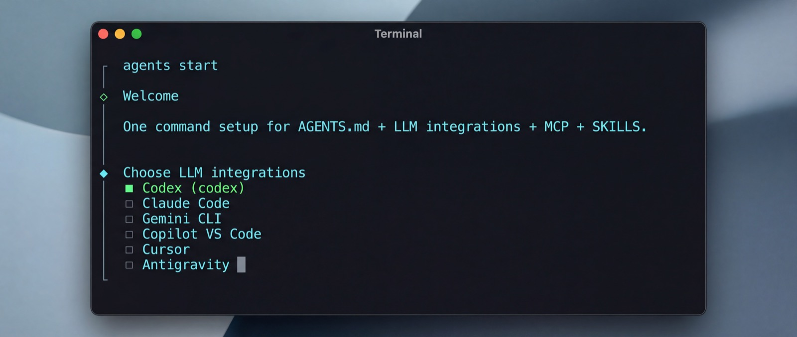

# agents

[](https://www.npmjs.com/package/@agents-dev/cli)
[](https://opensource.org/licenses/MIT)
[](https://github.com/amtiYo/agents)

> **One config to rule them all.**
> The practical standard layer for multi-LLM development.

<p align="center">
  
</p>

---

## ⚡️ The Problem

You're using **Codex**, **Claude**, **Cursor**, and **Gemini**. You have 6 different config files. You add an MCP server to one, and the others break. Your team's onboarding doc is a wiki page that's always out of date.

## ✨ The Solution

`agents` gives you **one source of truth**.

Define your configuration once in `.agents/`, and let the CLI handle the rest. We sync your MCP servers, skills, and instructions to **every tool automatically**.

```text
.agents/
  ├── agents.json      → All your MCP servers
  ├── local.json       → Your secrets (gitignored)
  └── skills/          → Reusable team workflows
```

## 🚀 Quick Start

### 1. Install

```bash
npm install -g @agents-dev/cli
```

### 2. Initialize

Go to your project folder and run:

```bash
agents start
```

The interactive wizard will guide you through:
- ✅ Creating the `.agents` folder
- ✅ Detecting your installed AI tools
- ✅ Setting up your first MCP server

### 3. Sync

Whenever you change your config, just run:

```bash
agents sync
```

Boom. All your tools are updated.

## 🛠️ Supported Tools

| Tool | MCP Integration | Skills | Instructions |
|:-----|:---------------:|:------:|:------------:|
| **Codex** | ✅ | ✅ | ✅ |
| **Claude Code** | ✅ | ✅ | ✅ |
| **Gemini CLI** | ✅ | ✅ | ✅ |
| **Cursor** | ✅ | ✅ | ✅ |
| **Copilot** | ✅ | ⏳ | ✅ |
| **Antigravity** | ✅ | ✅ | ✅ |

## 🎮 Command Cheat Sheet

| Command | Description |
|:--------|:------------|
| `agents start` | **Start here!** Interactive setup wizard. |
| `agents sync` | Syncs your `.agents` config to all tools. |
| `agents mcp add <url>` | Adds a new MCP server (e.g., from a URL). |
| `agents mcp list` | Lists all configured MCP servers. |
| `agents doctor` | Checks for configuration issues. |
| `agents status` | Shows connection status of all tools. |
| `agents watch` | Auto-syncs changes in real-time. |

## 📚 How It Works

1.  **You edit** `.agents/agents.json` (or use the CLI).
2.  **`agents` reads** your standard configuration.
3.  **`agents` generates** the specific config files for each tool (e.g., `.cursor/mcp.json`, `.claude/mcp.json`).
4.  **You focus** on coding, not configuring.

## ❓ FAQ

<details>
<summary><b>Does this replace AGENTS.md?</b></summary>
**No.** It *extends* it. `AGENTS.md` is for human-readable instructions. `agents` is for machine-readable configuration (MCP servers, skills). We support both.
</details>

<details>
<summary><b>Can I use this with just one tool?</b></summary>
**Yes!** It's still better than managing raw config files because it gives you a clean git strategy (commit `.agents`, ignore generated files) and easy MCP management commands.
</details>

<details>
<summary><b>Where are my API keys stored?</b></summary>
In `.agents/local.json`. This file is **gitignored** by default, so your secrets stay safe on your machine.
</details>

## 🤝 Community & Support

- 🐛 **Found a bug?** [Open an issue](https://github.com/amtiYo/agents/issues)
- 💡 **Have an idea?** [Start a discussion](https://github.com/amtiYo/agents/discussions)
- ⭐ **Love it?** Star us on GitHub!

---

<p align="center">
  <sub>Built with ❤️ for the AI coding community</sub>
</p>
