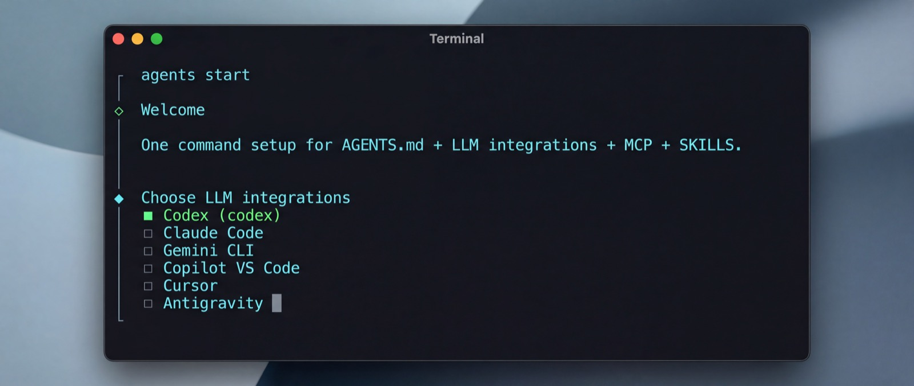

<h1 align="center">agents</h1>

<p align="center"><strong>One config to rule them all.</strong><br/>Practical standard layer for multi-LLM development.</p>

<p align="center">
  <a href="https://www.npmjs.com/package/@agents-dev/cli"></a>
  <a href="https://www.npmjs.com/package/@agents-dev/cli"></a>
  <a href="https://www.npmjs.com/package/@agents-dev/cli"></a>
  <a href="https://www.apache.org/licenses/LICENSE-2.0"></a>
</p>

<p align="center">
  <a href="#quick-start">Quick Start</a> ·
  <a href="#supported-integrations">Integrations</a> ·
  <a href="#command-overview">Commands</a> ·
  <a href="#faq">FAQ</a>
</p>

<p align="center">
  
</p>

---

## The Problem

Every AI coding tool wants its own config format:

| | Codex | Claude Code | Claude Desktop | Gemini | Cursor | Copilot VS Code | Copilot CLI | Antigravity | Windsurf | OpenCode | Junie |
|:--|:-----:|:-----------:|:---------------:|:------:|:------:|:---------------:|:-----------:|:-----------:|:--------:|:--------:|:-----:|
| **Config** | `.codex/config.toml` | CLI commands | Global `claude_desktop_config.json` | `.gemini/settings.json` | `.cursor/mcp.json` | `.vscode/mcp.json` | `.mcp.json` | `.agents/mcp_config.json` | Global `mcp_config.json` | `opencode.json` | `.junie/mcp/mcp.json` |
| **Instructions** | `AGENTS.md` | `CLAUDE.md` | — | `AGENTS.md` | `.cursorrules` | — | `AGENTS.md` | `AGENTS.md` | `AGENTS.md` | `AGENTS.md` | `AGENTS.md` |
| **Format** | TOML | JSON (via CLI) | JSON | JSON | JSON | JSON | JSON | JSON | JSON | JSON | JSON |

> **Result:** Duplicated configs, team drift, painful onboarding.

`agents` gives you **one source of truth** in `.agents/` and syncs MCP servers, skills, and instructions to every tool automatically.
For Claude Code, it keeps `AGENTS.md` canonical and generates a minimal root `CLAUDE.md` wrapper (`@AGENTS.md`) when the Claude integration is enabled.
For Claude Desktop, it syncs local stdio MCP servers into the global `claude_desktop_config.json` while preserving non-agents entries already in that file. Remote Claude MCP servers are managed by Claude custom connectors, not by this file.

---

## Quick Start

```bash
# 1. Install
npm install -g @agents-dev/cli

# 2. Interactive setup — picks integrations, adds MCP servers, syncs everything
agents start

# 3. Re-sync whenever config changes
agents sync
```

That's it. Your `.agents/agents.json` is now the single source of truth.

---

## Using agents in this repository

This repository uses `@agents-dev/cli` to keep MCP servers, skills, and instructions aligned across supported AI tools.

### Quick commands

```bash
agents status
agents mcp add <url-or-name>
agents mcp test --runtime
agents sync
agents sync --check
```

### One MCP setup for all tools

Add a server once in `.agents/agents.json`, then run `agents sync` to materialize it for enabled integrations.

### References

- MCP Protocol Docs: https://modelcontextprotocol.io
- MCP servers catalog: https://mcpservers.org
- Project examples: `docs/EXAMPLES.md`

---

## Supported Integrations

<table>
  <tr>
    <th align="left">Integration</th>
    <th align="center">MCP Servers</th>
    <th align="center">Skills</th>
    <th align="center">Instructions</th>
    <th align="left">How it syncs</th>
  </tr>
  <tr>
    <td><strong>Codex</strong></td>
    <td align="center">✅</td>
    <td align="center">✅</td>
    <td align="center">✅</td>
    <td>Writes <code>.codex/config.toml</code></td>
  </tr>
  <tr>
    <td><strong>Claude Code</strong></td>
    <td align="center">✅</td>
    <td align="center">✅</td>
    <td align="center">✅</td>
    <td>Calls <code>claude mcp add/remove</code> CLI + manages root <code>CLAUDE.md</code> wrapper</td>
  </tr>
  <tr>
    <td><strong>Claude Desktop</strong></td>
    <td align="center">✅</td>
    <td align="center">—</td>
    <td align="center">—</td>
    <td>Writes local stdio servers to global <code>claude_desktop_config.json</code> and preserves non-agents MCP entries</td>
  </tr>
  <tr>
    <td><strong>Gemini CLI</strong></td>
    <td align="center">✅</td>
    <td align="center">✅</td>
    <td align="center">✅</td>
    <td>Writes <code>.gemini/settings.json</code></td>
  </tr>
  <tr>
    <td><strong>Cursor</strong></td>
    <td align="center">✅</td>
    <td align="center">✅</td>
    <td align="center">✅</td>
    <td>Writes <code>.cursor/mcp.json</code> + CLI enable</td>
  </tr>
  <tr>
    <td><strong>Copilot VS Code</strong></td>
    <td align="center">✅</td>
    <td align="center">—</td>
    <td align="center">—</td>
    <td>Writes <code>.vscode/mcp.json</code></td>
  </tr>
  <tr>
    <td><strong>Copilot CLI</strong></td>
    <td align="center">✅</td>
    <td align="center">✅</td>
    <td align="center">✅</td>
    <td>Writes project <code>.mcp.json</code>; Copilot CLI reads <code>AGENTS.md</code> and <code>.agents/skills</code> natively</td>
  </tr>
  <tr>
    <td><strong>Antigravity</strong></td>
    <td align="center">✅</td>
    <td align="center">✅</td>
    <td align="center">✅</td>
    <td>Writes workspace <code>.agents/mcp_config.json</code>; Antigravity CLI (<code>agy</code>) reads <code>AGENTS.md</code> and <code>.agents/skills</code> natively</td>
  </tr>
  <tr>
    <td><strong>Windsurf</strong></td>
    <td align="center">✅</td>
    <td align="center">✅</td>
    <td align="center">✅</td>
    <td>Writes to global user profile <code>~/.codeium/windsurf/mcp_config.json</code> and preserves unmanaged entries + workspace <code>.windsurf/skills</code></td>
  </tr>
  <tr>
    <td><strong>OpenCode</strong></td>
    <td align="center">✅</td>
    <td align="center">✅</td>
    <td align="center">✅</td>
    <td>Writes project <code>opencode.json</code> (<code>mcp</code> block)</td>
  </tr>
  <tr>
    <td><strong>Junie</strong></td>
    <td align="center">✅</td>
    <td align="center">✅</td>
    <td align="center">✅</td>
    <td>Writes <code>.junie/mcp/mcp.json</code> + skills bridge <code>.junie/skills</code></td>
  </tr>
</table>

Antigravity note: `agents` manages the workspace MCP config used by Antigravity CLI. Global Antigravity editor/CLI profile files are left user-owned, and product limitations such as current Google/Google Cloud remote MCP OAuth caveats still apply.

---

## Project Layout

```
your-project/
├── AGENTS.md                        ← Canonical instructions for all tools
├── CLAUDE.md                        ← Generated Claude wrapper (`@AGENTS.md`)
├── .agents/
│   ├── agents.json                  ← MCP servers & config (commit this)
│   ├── local.json                   ← Secrets & overrides (gitignored)
│   ├── mcp_config.json              ← Generated Antigravity CLI MCP (gitignored in source-only mode)
│   ├── skills/                      ← Reusable workflow definitions
│   │   └── my-skill/SKILL.md
│   └── generated/                   ← Auto-generated artifacts (gitignored)
│       ├── codex.config.toml
│       ├── claude-desktop.mcp.json
│       ├── copilot.cli.mcp.json
│       ├── gemini.settings.json
│       ├── antigravity.mcp_config.json
│       ├── cursor.mcp.json
│       ├── windsurf.mcp.json
│       ├── opencode.json
│       └── ...
│
│  ┌─── Generated by `agents sync` ───┐
├── .codex/config.toml                │  Materialized tool configs
├── .gemini/settings.json             │  (gitignored in source-only mode)
├── .cursor/mcp.json                  │
├── .vscode/mcp.json                  │
├── .mcp.json                         │  Copilot CLI
├── .agents/mcp_config.json           │  Antigravity CLI
├── opencode.json                     │
├── .claude/skills/ → .agents/skills  │  Claude workspace bridges
├── .cursor/skills/ → .agents/skills  │
├── .gemini/skills/ → .agents/skills  │  Gemini workspace bridge
├── .windsurf/skills/ → .agents/skills│
└── .junie/skills/ → .agents/skills   │
```

> **Git strategy:** By default only `.agents/agents.json`, `.agents/skills/`, and `AGENTS.md` are committed. Generated `CLAUDE.md` and tool-specific outputs are gitignored in source-only mode and regenerated with `agents sync`.
> Claude Desktop MCP is materialized into the user's global `claude_desktop_config.json`, not into the project tree.

---

## Command Overview

### Setup & Sync

| Command | Description |
|:--------|:------------|
| `agents start` | Interactive setup wizard — integrations, MCP servers, skills, first sync |
| `agents start --inject-docs` | Also upsert an agents guide block in `README.md` (+ `CONTRIBUTING.md` if present) |
| `agents start --reinit` | Reinitialize existing `.agents/agents.json` with fresh wizard/default choices |
| `agents init` | Scaffold `.agents/` directory without guided setup |
| `agents sync` | Regenerate and materialize all tool configs |
| `agents sync --check` | Strict read-only drift check — exits `2` if config is out of sync |
| `agents watch` | Auto-sync on `.agents/` file changes (`--once` exits non-zero on sync failure) |

### Diagnostics

| Command | Description |
|:--------|:------------|
| `agents status` | Show integrations, MCP servers, file states, and live probes |
| `agents status --fast` | Skip external CLI probes for quicker output |
| `agents doctor` | Validate configs, check for issues, suggest fixes |
| `agents doctor --fix` | Auto-fix what can be fixed |
| `agents update` | Check for newer CLI version on npm |

### MCP Server Management

| Command | Description |
|:--------|:------------|
| `agents mcp add <name>` | Add a server interactively |
| `agents mcp add <url>` | Import a server from URL (mcpservers.org, GitHub, etc.) |
| `agents mcp import --file config.json` | Bulk import from JSON/JSONC file |
| `agents mcp list` | List all configured servers |
| `agents mcp remove <name>` | Remove a server (`--no-sync` skips auto-sync for add/import/remove) |
| `agents mcp test` | Validate server definitions |
| `agents mcp test --runtime` | Live connectivity check via tool CLIs |

### Integrations

| Command | Description |
|:--------|:------------|
| `agents connect --llm cursor,claude` | Add integrations to the currently enabled set |
| `agents disconnect --llm codex` | Disable integrations |
| `agents reset` | Remove generated files, keep `.agents/` |
| `agents reset --hard` | Full cleanup — removes all agents-managed setup |

---

## How It Works

```
┌──────────────────────────────────────────────────────────────┐
│                      agents sync                             │
├──────────────────────────────────────────────────────────────┤
│                                                              │
│   .agents/agents.json ─── merge ──→ Resolved    ──→ Codex   │
│         (shared)           ↑        Registry          TOML   │
│                            │           │                     │
│   .agents/local.json ──────┘           ├────────→ Claude     │
│      (secrets)                         │          CLI + root │
│                                        │          CLAUDE.md  │
│                                        ├────────→ Claude     │
│                                        │          Desktop    │
│                                        │          Global JSON│
│                                        ├────────→ Gemini     │
│   ${ENV_VARS} ─── resolve ─────────────┤          JSON       │
│   ${PROJECT_ROOT}                      ├────────→ Cursor     │
│                                        │          JSON + CLI │
│                                        ├────────→ Copilot    │
│                                        │          VS Code + CLI │
│                                        ├────────→ Antigravity│
│                                        │          .agents/   │
│                                        │          mcp_config │
│                                        ├────────→ Windsurf   │
│                                        │          Global MCP │
│                                        ├────────→ OpenCode   │
│                                        │          opencode.json │
│                                        └────────→ Junie      │
│                                                   .junie/mcp/ │
│                                                              │
│   .agents/skills/ ── symlink ──→ .claude/skills              │
│                                  .cursor/skills              │
│                                  .gemini/skills              │
│                                  .junie/skills               │
│                                  .windsurf/skills            │
└──────────────────────────────────────────────────────────────┘
```

1. **Load** — reads `.agents/agents.json` + merges secrets from `.agents/local.json`
2. **Resolve** — expands `${PROJECT_ROOT}`, `${ENV_VAR}` placeholders, filters by `enabled` and `requiredEnv`
3. **Route** — sends each server to its target integrations (or all, if no `targets` specified)
4. **Generate** — renders tool-specific config formats (TOML for Codex, JSON for others)
5. **Materialize** — writes configs atomically (project-local and global targets), calls CLIs for Claude Code/Cursor, writes global configs with scoped merge/cleanup, and manages Claude Code's root `CLAUDE.md` wrapper
6. **Bridge skills** — creates symlinks from tool directories to `.agents/skills/` where needed; Codex, Antigravity CLI, Copilot CLI, and OpenCode read `.agents/skills/` directly

---

## MCP Server Examples

### Add from mcpservers.org

```bash
agents mcp add https://mcpservers.org/servers/context7-mcp
```

### Add a stdio server

```bash
agents mcp add my-server \
  --command npx \
  --arg @my-org/mcp-server \
  --arg /path/to/project
```

### Add an HTTP server with secrets

```bash
agents mcp add company-api \
  --url "https://api.company.com/mcp" \
  --secret-header "Authorization=Bearer YOUR_API_TOKEN"
```

> Secrets are automatically detected and split: placeholders go to `agents.json` (committed), real values to `local.json` (gitignored).

### Target specific tools

```bash
# Only for Claude Code
agents mcp add claude-only-server --url "https://..." --target claude

# Only for Claude Desktop
agents mcp add desktop-only-server --command npx --arg @my-org/server --target claude_desktop

# Only for Cursor and Copilot in VS Code
agents mcp add ide-server --command ide-mcp --target cursor --target copilot_vscode

# Only for Copilot CLI
agents mcp add copilot-cli-server --command npx --arg @my-org/server --target copilot_cli
```

---

## Security

| | What | Where |
|:--|:-----|:------|
| 🔓 | Server definitions, team config | `.agents/agents.json` — **committed** |
| 🔒 | API keys, tokens, secrets | `.agents/local.json` — **gitignored** |

**How secrets work:**
- When you add a server, `agents` detects secret-like values (API keys, tokens, JWTs)
- Secrets are moved to `local.json` and replaced with `${PLACEHOLDER}` in `agents.json`
- `agents doctor` warns if it finds literal secrets in committed config
- All env keys and header names are validated to prevent injection

---

## Team Workflow

**Lead sets up the project:**
```bash
agents start
agents mcp add https://mcpservers.org/servers/context7-mcp
agents mcp add company-api --url "https://api.company.com/mcp" \
  --secret-header "Authorization=Bearer YOUR_API_TOKEN"
git add .agents/agents.json .agents/skills/ AGENTS.md && git commit -m "Add agents config"
```

**New member onboards:**
```bash
git clone <repo> && cd <repo>
agents start        # Preserves team config and syncs local tool files
# Add your local secrets in .agents/local.json if required by project MCP servers
```

> One command. Same MCP servers, same skills, same instructions. No drift.

---

## FAQ

<details>
<summary><b>Does this replace AGENTS.md?</b></summary>
<br/>
No. It extends it. <code>AGENTS.md</code> is human-readable guidance for LLMs; <code>agents</code> handles machine-readable config (MCP servers, skills) and keeps everything in sync.
When Claude integration is enabled, <code>agents</code> also generates a minimal root <code>CLAUDE.md</code> wrapper that references <code>AGENTS.md</code>.
</details>

<details>
<summary><b>Can I use this with only one tool?</b></summary>
<br/>
Yes. You still get cleaner config management, safer git defaults, secret splitting, and easy MCP server management — even for a single tool.
</details>

<details>
<summary><b>Where should secrets live?</b></summary>
<br/>
In <code>.agents/local.json</code> (gitignored by default). The CLI automatically splits secrets from public config when you add MCP servers.
</details>

<details>
<summary><b>What happens during <code>agents sync</code>?</b></summary>
<br/>
It reads your <code>.agents/</code> config, merges secrets, resolves placeholders, generates tool-specific files, and writes them atomically. For Claude Code and Cursor it also calls their CLIs to register servers. Claude Desktop stdio servers are synced by updating its global <code>claude_desktop_config.json</code> without touching non-agents MCP entries. The whole process is idempotent and safe to run repeatedly.
For Claude Code it also maintains a root <code>CLAUDE.md</code> wrapper without duplicating the contents of <code>AGENTS.md</code>.
</details>

<details>
<summary><b>How do I keep configs in sync automatically?</b></summary>
<br/>
Run <code>agents watch</code> — it polls <code>.agents/</code> files and auto-syncs on changes. Or run <code>agents sync</code> manually after editing config.
</details>

<details>
<summary><b>Can I target an MCP server to specific tools only?</b></summary>
<br/>
Yes. Add <code>"targets": ["claude", "claude_desktop", "cursor"]</code> to a server definition in <code>agents.json</code>, or use the <code>--target</code> flag with <code>agents mcp add</code>. Servers without targets stay universal and are included for integrations as they are enabled.
</details>

<details>
<summary><b>Any Claude Desktop caveats?</b></summary>
<br/>
Yes. Claude Desktop local JSON sync is stdio-only. HTTP/SSE MCP servers should be added in Claude as custom connectors or wrapped by a stdio bridge. Prefer absolute paths in <code>command</code>/<code>args</code>, and avoid relying on <code>cwd</code> for Desktop-targeted servers.
</details>

---

## Docs

| | Resource |
|:--|:---------|
| 📖 | [Usage Examples](docs/EXAMPLES.md) — solo dev, teams, monorepos, scripting |
| 🏗️ | [System Architecture](docs/agents-system.md) — sync internals, file formats, security model |
| 📋 | [Changelog](CHANGELOG.md) — version history and migration notes |

---

## Community

<p>
  <a href="https://github.com/amtiYo/agents/issues"></a>
  <a href="https://github.com/amtiYo/agents/discussions"></a>
  <a href="https://www.npmjs.com/package/@agents-dev/cli"></a>
</p>
