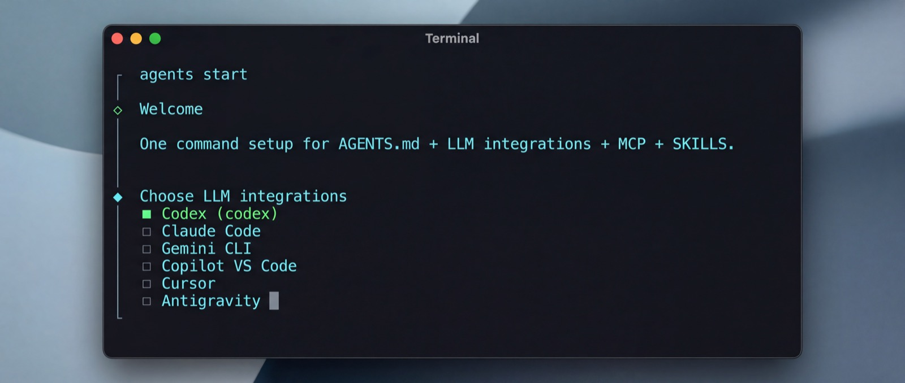

<h1 align="center">agents</h1>

<p align="center"><strong>One config to rule them all.</strong><br/>Practical standard layer for multi-LLM development.</p>

<p align="center">
  <a href="https://www.npmjs.com/package/@agents-dev/cli"></a>
  <a href="https://www.npmjs.com/package/@agents-dev/cli"></a>
  <a href="https://www.npmjs.com/package/@agents-dev/cli"></a>
  <a href="https://www.apache.org/licenses/LICENSE-2.0"></a>
</p>

<p align="center">
  <a href="#quick-start">Quick Start</a> ·
  <a href="#supported-integrations">Integrations</a> ·
  <a href="#command-overview">Commands</a> ·
  <a href="#agent-plugins">Plugins</a> ·
  <a href="#faq">FAQ</a>
</p>

<p align="center">
  
</p>

---

## The Problem

Instructions converged on `AGENTS.md` and skills converged on `SKILL.md`. MCP server configuration did not. Every tool keeps its own file, in its own format, in its own place:

| Format | Tools |
|:--|:--|
| TOML, `mcp_servers` tables | Codex (`.codex/config.toml`), Grok Build (`.grok/config.toml`) |
| JSON, `mcpServers` key | Claude Code and Copilot CLI (`.mcp.json`), Claude Desktop (global), Gemini CLI (`.gemini/settings.json`), Cursor (`.cursor/mcp.json`), Antigravity (`.agents/mcp_config.json`), Devin Desktop (global), Devin CLI (`.devin/mcp_config.json`), Junie (`.junie/mcp/mcp.json`), Factory Droid (`.factory/mcp.json`) |
| JSON, another key | Copilot VS Code (`servers`), OpenCode and Kilo (`mcp`), Amp (`amp.mcpServers`), Zed (`context_servers`) |
| YAML | Goose (`extensions` in `~/.config/goose/config.yaml`) |

Add a server by hand and you write it 18 times, then watch the copies drift apart.

`agents` keeps one source of truth in `.agents/` and materializes it for every tool you enable.

---

## Quick Start

```bash
# 1. Install
npm install -g @agents-dev/cli

# 2. Interactive setup — picks integrations, adds MCP servers, syncs everything
agents start

# 3. Re-sync whenever config changes
agents sync
```

`.agents/agents.json` is now the single source of truth. `agents sync --check` exits `2` when a tool config has drifted, so it works as a CI gate.

---

## Supported Integrations

Eighteen tools. "Verified" means the tool's own CLI was run against the file this project writes; the rest follow vendor documentation and are worth reporting on if something is off.

| Integration | `--llm` id | MCP config it writes | Skills | Verified |
|:--|:--|:--|:--:|:--:|
| Codex | `codex` | `.codex/config.toml` (managed block, project trust handled) | native | ✅ |
| Claude Code | `claude` | `.mcp.json` project scope, plus root `CLAUDE.md` wrapper | bridge | ✅ |
| Claude Desktop | `claude_desktop` | global `claude_desktop_config.json`, stdio servers only | — | ✅ |
| Gemini CLI | `gemini` | `.gemini/settings.json` | bridge | ✅ |
| Cursor | `cursor` | `.cursor/mcp.json` + CLI enable | bridge | ✅ |
| Copilot VS Code | `copilot_vscode` | `.vscode/mcp.json` | native | ✅ |
| Copilot CLI | `copilot_cli` | `.mcp.json`, or `.github/mcp.json` | native | ✅ |
| Antigravity | `antigravity` | `.agents/mcp_config.json` | flat copy | ✅ |
| Devin Desktop (Windsurf) | `windsurf`, `devin_desktop` | global `~/.codeium/windsurf/mcp_config.json` | bridge | ✅ |
| OpenCode | `opencode` | `opencode.json` (`mcp`) | native | ✅ |
| Junie | `junie` | `.junie/mcp/mcp.json` | bridge | ✅ |
| Grok Build | `grok` | `.grok/config.toml` (managed block, folder trust handled) | native | ✅ |
| Amp | `amp` | `.amp/settings.json` (`amp.mcpServers`) | native | ✅ |
| Factory Droid | `droid`, `factory` | `.factory/mcp.json` | native | ✅ |
| Kilo | `kilo`, `kilocode` | `.kilo/kilo.jsonc` (`mcp`) | bridge | — |
| Devin CLI | `devin` | `.devin/mcp_config.json` | native | ✅ |
| Zed | `zed` | `.zed/settings.json` (`context_servers`) | native | — |
| Goose | `goose` | `~/.config/goose/config.yaml` (`extensions`) | native | ✅ |

**Skills column.** `bridge` means a symlink from the tool's directory to `.agents/skills` (a copy where symlinks are unavailable). `native` means the tool reads `.agents/skills` itself, so nothing is created. `—` means the tool's project-level skill location is not implemented here.

**Grok folder trust.** Grok ignores a project's MCP servers and its skills until the folder is trusted, and says nothing about it: `grok inspect` simply lists none. Trust lives in `~/.grok/trusted_folders.toml`, separate from `config.toml`. `agents doctor` reports an untrusted folder and `agents doctor --fix` records the trust.

**Shared files.** `.mcp.json` is read by both Claude Code and Copilot CLI, so `agents` writes it once for both. A server targeted at only one of them is still visible to the other; the sync says so rather than pretending targets isolate it.

**Goose secrets.** Goose reads credentials from the environment through `env_keys`, so values are never written into its config. The sync lists which variables have to exist in your shell.

---

## Project Layout

```
your-project/
├── AGENTS.md                        ← Canonical instructions for all tools
├── CLAUDE.md                        ← Generated Claude wrapper (`@AGENTS.md`)
├── .agents/
│   ├── agents.json                  ← MCP servers, profiles, config (commit this)
│   ├── local.json                   ← Secrets & overrides (gitignored)
│   ├── mcp_config.json              ← Generated Antigravity workspace MCP
│   ├── skills/                      ← Reusable workflow definitions
│   │   └── my-skill/SKILL.md
│   └── generated/                   ← Auto-generated artifacts (gitignored)
│
│  ┌─── Generated by `agents sync` ───┐
├── .mcp.json                         │  Claude Code + Copilot CLI
├── .codex/config.toml                │  Codex
├── .grok/config.toml                 │  Grok Build
├── .gemini/settings.json             │  Gemini CLI
├── .cursor/mcp.json                  │  Cursor
├── .vscode/mcp.json                  │  Copilot VS Code
├── .amp/settings.json                │  Amp
├── .factory/mcp.json                 │  Factory Droid
├── .kilo/kilo.jsonc                  │  Kilo
├── .devin/mcp_config.json            │  Devin CLI
├── .zed/settings.json                │  Zed
├── opencode.json                     │  OpenCode
├── .junie/mcp/mcp.json               │  Junie
└── .claude/skills → .agents/skills   │  Skill bridges
```

> **Git strategy.** In the default `source-only` mode, only `.agents/agents.json`, `.agents/skills/` and `AGENTS.md` are committed: everything the sync generates is gitignored and rebuilt from them. In `commit-generated` mode the generated files stay out of `.gitignore`, so a clone gets working tool configs without installing this CLI. That is how you commit `.mcp.json` for the rest of the team.
>
> Either way, files that hold a tool's own settings (`.zed/settings.json`, `.amp/settings.json`, `.kilo/kilo.jsonc`) and `.github/mcp.json` are never added to `.gitignore`: the sync merges its entries into them and leaves the rest of the file, including whether you track it, to you.

---

## Command Overview

### Setup & Sync

| Command | Description |
|:--------|:------------|
| `agents start` | Interactive setup: integrations, MCP servers, skills, first sync |
| `agents init` | Scaffold `.agents/` without the wizard |
| `agents sync` | Regenerate and materialize all tool configs |
| `agents sync --check` | Read-only drift check, exits `2` when out of sync |
| `agents sync --profile ci` | Sync one profile without changing the active one |
| `agents watch` | Auto-sync on `.agents/` changes |

### Diagnostics

| Command | Description |
|:--------|:------------|
| `agents status` | Integrations, MCP servers, file states, live probes |
| `agents doctor` | Validate configs and report problems |
| `agents doctor --fix` | Apply the fixes it can make safely |
| `agents update` | Check npm for a newer CLI |

### MCP Servers

| Command | Description |
|:--------|:------------|
| `agents mcp add <name\|url>` | Add a server interactively or from a URL |
| `agents mcp import --file config.json` | Bulk import from JSON/JSONC |
| `agents mcp list` | List configured servers |
| `agents mcp remove <name>` | Remove a server |
| `agents mcp test [--runtime]` | Validate definitions, optionally through tool CLIs |
| `agents mcp budget` | Connect to each server and measure its context cost |

### Profiles

| Command | Description |
|:--------|:------------|
| `agents profile set ci --server docs --server git` | Create or replace a profile |
| `agents profile use ci` | Activate a profile and sync |
| `agents profile use` | Clear the profile, back to every server |
| `agents profile list` | Show profiles and the active one |
| `agents profile remove ci` | Delete a profile |

### Plugins

| Command | Description |
|:--------|:------------|
| `agents plugin export --name my-stack` | Build an Agent Plugins v1 package from `.agents` |
| `agents plugin validate <dir>` | Check a package against the specification |
| `agents plugin import <dir>` | Add a package's servers and skills to this project |

### Skills & Integrations

| Command | Description |
|:--------|:------------|
| `agents skills list` | List skills found under `.agents/skills/` |
| `agents connect --llm cursor,grok` | Enable integrations |
| `agents disconnect --llm codex` | Disable integrations |
| `agents reset` | Remove generated files, keep `.agents/` |
| `agents reset --hard` | Full cleanup |

### Global Mode

Run any command with `--global` (or `-g`, or from `$HOME`) to manage MCP servers and skills machine-wide from `~/.agents/agents.json`:

```bash
agents init -g
agents connect -g --llm opencode,codex,grok
agents sync -g
```

Tools that only have a user-level config (Claude Desktop, Devin Desktop, Goose) are written there in both modes.

---

## Agent Plugins

[Agent Plugins 1.0.0](https://agent-plugins.org/specification) is a vendor-neutral package format for skills and MCP servers, read by ChatGPT and Codex, Cursor, GitHub Copilot, Kiro and VS Code. A package is a directory with `plugin.json`, an `mcp.json` and a `skills/` folder, which is close to what `.agents/` already holds.

```bash
agents plugin export --name my-stack --plugin-version 1.0.0
```

```
dist/agent-plugin/
├── plugin.json      $schema, name, version, description
├── mcp.json         $schema, mcpServers
└── skills/          copied from .agents/skills
```

Export reads `.agents/agents.json` only, never `local.json`: what ships is the `${VAR}` placeholder from the committed file, and the command prints which variables the package needs. `${PROJECT_ROOT}` becomes the specification's `${PLUGIN_ROOT}`.

Going the other way, `agents plugin import ./some-plugin` adds the package's servers under its plugin name (`my-stack.docs`) so nothing you already defined is replaced.

---

## Context Budget

MCP servers cost context before an agent does any work: every tool definition is loaded up front.

```bash
agents mcp budget
```

```
MCP context budget:
  everything              13 tools  ~  1916 tokens
  filesystem              11 tools  ~  1240 tokens
  broken                 error: spawn broken-server ENOENT

Servers        3
Tools          24
Estimated      ~3156 tokens of context
```

The command speaks MCP `2026-07-28` directly over stdio and streamable HTTP, so the numbers come from the servers themselves. Servers built against the handshake revisions (`2025-11-25` and earlier) are detected and handled the way the specification prescribes, so both eras work. Token counts are estimated from the size of the tool definitions, not measured by a model. Add `--verbose` for a per-tool breakdown, and `--profile` to measure what one profile would cost.

Servers whose config still contains an unresolved `${VAR}` are skipped rather than started.

---

## MCP Server Examples

```bash
# From a catalog URL
agents mcp add https://mcpservers.org/servers/context7-mcp

# stdio server
agents mcp add my-server --command npx --arg @my-org/mcp-server --arg /path/to/project

# HTTP server with a secret header
agents mcp add company-api --url "https://api.company.com/mcp" \
  --secret-header "Authorization=Bearer YOUR_API_TOKEN"

# Only for specific tools
agents mcp add ide-server --command ide-mcp --target cursor --target zed
```

A server definition supports `timeout`, `connectTimeout`, `tools`, `disabledTools`, `oauth`, `headersHelper`, `bearerTokenEnvVar` and `envFile`. Each is written only for the tools that document it, and the sync says when a field is dropped for a target that does not support it.

Values support `${VAR}` and `${VAR:-default}`, plus `${PROJECT_ROOT}`.

---

## Security

| | What | Where |
|:--|:-----|:------|
| 🔓 | Server definitions, team config | `.agents/agents.json` — **committed** |
| 🔒 | API keys, tokens, secrets | `.agents/local.json` — **gitignored** |

- Secret-looking values are moved to `local.json` and replaced with `${PLACEHOLDER}` in `agents.json` when a server is added.
- `agents doctor` warns about literal secrets in committed config.
- Env keys and header names are validated before they reach a config file or a shell.
- `agents plugin export` never reads `local.json`.
- Values from `local.json` are written only into configs this CLI gitignores. Amp, Zed and Kilo share a file with the tool's own settings, and `.github/mcp.json` is a file teams review, so those keep the `${VAR}` placeholder from `agents.json` and the sync lists which variables to export in your shell. `commit-generated` mode holds secrets back from every generated config for the same reason.
- A config this CLI rewrites keeps the permissions it had, so a file you restricted to `0600` stays that way.

---

## Team Workflow

**Lead sets up the project:**
```bash
agents start
agents mcp add https://mcpservers.org/servers/context7-mcp
git add .agents/agents.json .agents/skills/ AGENTS.md && git commit -m "Add agents config"
```

In `source-only` mode that is everything the team needs: each clone runs `agents sync` and
gets the tool configs locally. Switch `syncMode` to `commit-generated` if you would rather
commit `.mcp.json` and the rest for people who do not install the CLI.

**New member onboards:**
```bash
git clone <repo> && cd <repo>
agents start        # keeps the committed config, writes local tool files
```

**CI:**
```bash
agents sync --check  # exits 2 when a tool config drifted from .agents/
```

---

## FAQ

<details>
<summary><b>Does this replace AGENTS.md?</b></summary>
<br/>
No. <code>AGENTS.md</code> stays the instruction file every tool reads. This CLI handles the machine-readable side (MCP servers, skills, per-tool config) and generates the minimal root <code>CLAUDE.md</code> wrapper Claude Code needs, since Claude Code does not read <code>AGENTS.md</code>.
</details>

<details>
<summary><b>Why does Claude Code use <code>.mcp.json</code> now?</b></summary>
<br/>
Project scope is the location Anthropic documents for teams: it lives in the repository, so everyone working on it gets the same servers, and in `commit-generated` mode it is reviewed like any other file. Before 0.9.0 the CLI registered servers in the machine-local <code>~/.claude.json</code>, which nobody else could see. Set <code>integrations.options.claudeScope</code> to <code>"local"</code> for the old behaviour; projects upgrading from schema 3 keep it automatically.
</details>

<details>
<summary><b>Can I use this with only one tool?</b></summary>
<br/>
Yes. Secret splitting, drift checks, plugin export and the context budget are useful with a single tool.
</details>

<details>
<summary><b>What happens during <code>agents sync</code>?</b></summary>
<br/>
It reads <code>.agents/</code>, merges <code>local.json</code>, resolves placeholders, applies the active profile, renders each tool's format and writes files atomically. Files shared with a tool's own settings (Amp, Zed, Kilo, Gemini, OpenCode, Goose) are merged, so settings the CLI does not own survive. Runs are idempotent.
</details>

<details>
<summary><b>Can I target an MCP server to specific tools only?</b></summary>
<br/>
Yes, with <code>"targets"</code> in the definition or <code>--target</code> on <code>agents mcp add</code>. The exception is <code>.mcp.json</code>, which Claude Code and Copilot CLI both read: a server in that file is visible to both, and the sync warns instead of implying otherwise.
</details>

<details>
<summary><b>What does <code>agents doctor</code> check?</b></summary>
<br/>
Missing or invalid config, literal secrets in committed files, unresolved env vars, drift in generated files, Codex project trust, a global Codex config that cannot be parsed, deprecated <code>sse</code> transports, skill frontmatter against the Agent Skills specification, and the state of skill bridges.
</details>

<details>
<summary><b>How do I upgrade from 0.8.x?</b></summary>
<br/>
Run any command. <code>.agents/agents.json</code> migrates from schema 3 to 4 automatically and the previous file is kept as <code>agents.json.v3.bak</code>. Nothing else is required.
</details>

---

## Documentation

- [`docs/agents-system.md`](docs/agents-system.md) — how sync, skills and generated files work
- [`docs/EXAMPLES.md`](docs/EXAMPLES.md) — project setups
- [`CONTRIBUTING.md`](CONTRIBUTING.md) — development workflow
- [`CHANGELOG.md`](CHANGELOG.md) — release history

## License

Apache 2.0. See [LICENSE](LICENSE) and [NOTICE](NOTICE).
